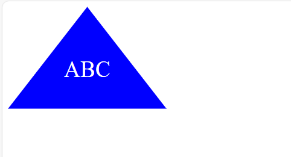

# Logo Maker Application
A Node.js command-line application to effortlessly create custom logos as SVG files for the web projects.  

# Example svg files created with the app

  

## Demo
https://drive.google.com/file/d/1mErXAFzOv6HFFDj2MROihHhTLIvpj7kR/view?usp=sharing
   
# Technologies Used
Node.js  
Inquirer.js  
Jest  
File System (fs) Module  
JavaScript Classes  
SVG

# Acceptance Criteria
The application should prompt the user to enter text, up to three characters.
The user should be able to specify a color for the text using a color keyword or hexadecimal number.
The user should choose a shape from a list of options: circle, triangle, or square.
The user should enter a color for the shape using a color keyword or hexadecimal number.
After collecting all inputs, the application should create an SVG file named logo.svg in the specified dimensions of 300x200 pixels.
The application should display a success message "Generated logo.svg" upon file creation.
Opening logo.svg in a browser should display the logo according to the specified parameters.